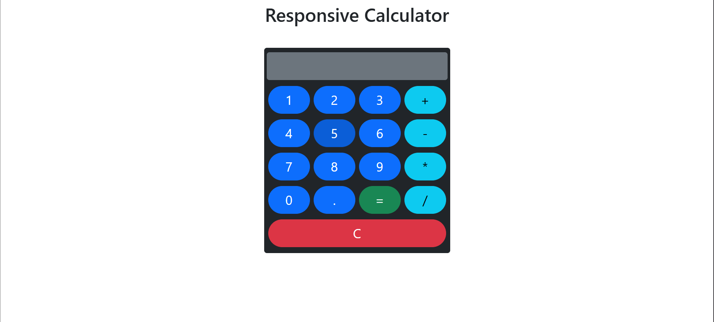

# Responsive Calculator

A **fully responsive calculator** built using **HTML, CSS, Bootstrap, and basic JavaScript**.  
This calculator features a modern design with **colored buttons**, **rounded corners**, and a **right-aligned display**. It works perfectly on **mobile, tablet, and desktop screens**.

---

## 🔗 Live Demo

[View Live Calculator](https://dharani2816.github.io/Calculator/)

> Replace `YOUR_LIVE_DEMO_LINK` with your hosted project URL (e.g., GitHub Pages).

---

## 📸 Preview



> This is a preview of the calculator layout.

---

## 💻 Features

- Fully **responsive design** for mobile, tablet, and desktop  
- **Colored buttons**:  
  - Blue for numbers  
  - Light blue for operators (`+`, `-`, `*`, `/`)  
  - Green for equals (`=`)  
  - Red for clear (`C`)  
- Buttons are **rounded-pill** for modern look  
- **Right-aligned display** simulating a real calculator  
- Basic **JavaScript functionality** for arithmetic operations  
- **Clean layout** using Bootstrap grid and spacing  

---

## 🛠️ Technologies Used

- **HTML5** – Structure of the calculator  
- **CSS3** – Custom styling and gradients  
- **Bootstrap 5** – Responsive grid system, buttons, spacing, and utilities  
- **JavaScript** – Button functionality and calculations  

---

## 📦 How to Use

1. Clone the repository:

```bash
git clone YOUR_REPOSITORY_LINK
